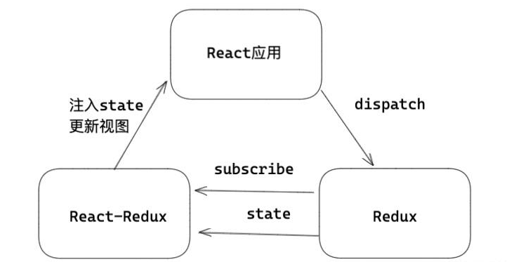

# React-Redux

## React-Redux,Redux 三者关系

> Redux： 首先 Redux 是一个应用状态管理 js 库，它本身和 React 是没有关系的，换句话说，Redux 可以应用于其他框架构建的前端应用，甚至也可以应用于 Vue 中。
>
> React-Redux：React-Redux 是连接 React 应用和 Redux 状态管理的桥梁。React-redux 主要专注两件事，一是如何向 React 应用中注入 redux 中的 Store ，二是如何根据 Store 的改变，把消息派发给应用中需要状态的每一个组件。



## Redux 三大原则

### 三大特性

1. 单向数据流
2. state 只读：要想改变 state，必须触发一次 action 执行 reducer
3. 纯函数执行：每个 reducer 都是一个纯函数

### 发布订阅思想

> redux 可以作为发布订阅模式的一个具体实现。redux 都会创建一个 store ，里面保存了状态信息，改变 store 的方法 dispatch ，以及订阅 store 变化的方法 subscribe 。

### 中间件思想 `compose`

> 强化 dispatch ， Redux 提供了中间件机制，使用者可以根据需要来强化 dispatch 函数，传统的 dispatch 是不支持异步的，但是可以针对 Redux 做强化，于是有了 redux-thunk，redux-actions 等中间件，包括 dvajs 中，也写了一个 redux 支持 promise 的中间件

```ts
// funcs 为中间件组成的数组，compose 通过数组的 reduce 方法，实现执行每一个中间件，强化 dispatch 。
const compose = (...funcs) => {
  return funcs.reduce((f, g) => (x) => f(g(x)));
};
```

### 核心 api

1. createStore

   ```ts
   const Store = createStore(rootReducer, initialState, middleware);
   // 参数一 reducers ： redux 的 reducer ，如果有多个那么可以调用 combineReducers 合并。
   // 参数二 initialState ：初始化的 state 。
   // 参数三 middleware ：如果有中间件，那么存放 redux 中间件。
   ```

2. combineReducers：正常状态可以会有多个 reducer ，combineReducers 可以合并多个 reducer。

   ```ts
   /* 将 number 和 info 两个 reducer 合并   */
   const rootReducer = combineReducers({
     number: numberReducer,
     info: InfoReducer,
   });
   ```

3. applyMiddleware：注册中间价，支持多个参数，每一个参数都是一个中间件。每次触发 action ，中间件依次执行

   ```ts
   const middleware = applyMiddleware(logMiddleware);
   ```

### Redux 存在的问题

1. 状态公用问题
2. 每一个需要状态的组件都用 subscribe / unSubscribe 来进行订阅
3. 状态更新问题

## React-Redux

> React-Redux 是沟通 React 和 Redux 的桥梁

[示例](../../../../apps/react-project/src/components/ReactRedux.tsx)

### 功能

1. 接受 Redux 的 Store，并把它合理分配到所需要的组件中。
2. 订阅 Store 中 state 的改变，促使消费对应的 state 的组件更新。

### Provider 组件

> 作用就是保存 Redux 中的 store ，分配给所有需要 state 的子孙组件

```tsx
// 例子
export default function Root() {
  return (
    <Provider store={Store}>
      <Index />
    </Provider>
  );
}
```

### connect 组件

> 需要 Store 中的状态或者想要改变 Store 的状态，使用 connect 高阶组件

**功能：**

1. 能够从 props 中获取改变 state 的方法 Store.dispatch 。
2. 如果 connect 有第一个参数，那么会将 redux state 中的数据，映射到当前组件的 props 中，子组件可以使用消费。
3. 当需要的 state ，有变化的时候，会通知当前组件更新，重新渲染视图。

```ts
function connect(mapStateToProps?, mapDispatchToProps?, mergeProps?, options?);

const mapStateToProps = (state) => ({ number: state.number });
// 组件依赖 redux 的 state，映射到业务组件的 props 中，state 改变触发，业务组件 props 改变，触发业务组件更新视图。当这个参数没有的时候，当前组件不会订阅 store 的改变。

const mapDispatchToProps = (dispatch) => {
  return {
    numberAdd: () => dispatch({ type: "ADD" }),
    setInfo: () => dispatch({ type: "SET" }),
  };
};
// 将 redux 中的 dispatch 方法，映射到业务组件的 props 中。比如将如上 demo 中的两个方法映射到 props ，变成了 numberAdd ， setInfo 方法。

/*
* stateProps , state 映射到 props 中的内容
* dispatchProps， dispatch 映射到 props 中的内容。
* ownProps 组件本身的 props
*/
(stateProps, dispatchProps, ownProps) => Object
// 正常情况下，如果没有这个参数，会按照如下方式进行合并，返回的对象可以是，可以自定义的合并规则，还可以附加一些属性。
{ ...ownProps, ...stateProps, ...dispatchProps }

// options
{
  context?: Object,   // 自定义上下文
  pure?: boolean, // 默认为 true , 当为 true 的时候 ，除了 mapStateToProps 和 props ,其他输入或者state 改变，均不会更新组件。
  areStatesEqual?: Function, // 当pure true , 比较引进store 中state值 是否和之前相等。 (next: Object, prev: Object) => boolean
  areOwnPropsEqual?: Function, // 当pure true , 比较 props 值, 是否和之前相等。 (next: Object, prev: Object) => boolean
  areStatePropsEqual?: Function, // 当pure true , 比较 mapStateToProps 后的值 是否和之前相等。  (next: Object, prev: Object) => boolean
  areMergedPropsEqual?: Function, // 当 pure 为 true 时， 比较 经过 mergeProps 合并后的值 ， 是否与之前等  (next: Object, prev: Object) => boolean
  forwardRef?: boolean, //当为true 时候,可以通过ref 获取被connect包裹的组件实例。
}
```

## React-Redux 原理

### Provider 注入 Store

**Provider**

1. 首先知道 React-Redux 是通过 context 上下文来保存传递 Store 的，但是上下文 value 保存的除了 Store 还有**subscription** 。
2. subscription 可以理解为订阅器，在 React-redux 中一方面用来订阅来自 state 变化，另一方面通知对应的组件更新。在 Provider 中的订阅器 subscription 为根订阅器，
3. 在 Provider 的 useEffect 中，进行真正的绑定订阅功能，其原理内部调用了 store.subscribe ，只有根订阅器才会触发 store.subscribe

### Subscription 订阅器

> 通过 connect 高阶组件或 useSelector Hook 实现的。当你使用 connect 或 useSelector 将组件连接到 Redux store 时，这个组件就会订阅 store 中的状态变化。

```tsx
// 例子
// MyComponent 组件订阅了 state.number 的变化。当 state.number 变化时，MyComponent 会重新渲染。
import { connect } from "react-redux";

function MyComponent({ number }) {
  return <div>{number}</div>;
}

const mapStateToProps = (state) => ({
  number: state.number,
});

export default connect(mapStateToProps)(MyComponent);
```

### connect 控制更新

**核心流程**

1. connect 中有一个 selector 的概念，selector 有什么用？就是通过 mapStateToProps ，mapDispatchToProps ，把 redux 中 state 状态合并到 props 中，得到最新的 props 。
2. 每一个 connect 都会产生一个新的 Subscription ，和父级订阅器建立起关联，这样父级会触发子代的 Subscription 来实现逐层的状态派发。
3. 有一点很重要，就是 Subscription 通知的是 **checkForUpdates** 函数，checkForUpdates 会形成新的 props ，与之前缓存的 props 进行**浅比较，**如果不相等，那么说明 state 已经变化了，直接触发一个 useReducer 来更新组件，如果相等，那么当前组件不需要更新，直接通知子代 Subscription ，检查子代 Subscription 是否更新，完成整个流程。

## 基于 Redux 异步的库

1. redux-thunk
2. redux-saga：基于 `generator` 实现
3. dvajs：基于 `redux-saga` 基础上，实现的异步的状态管理工具
